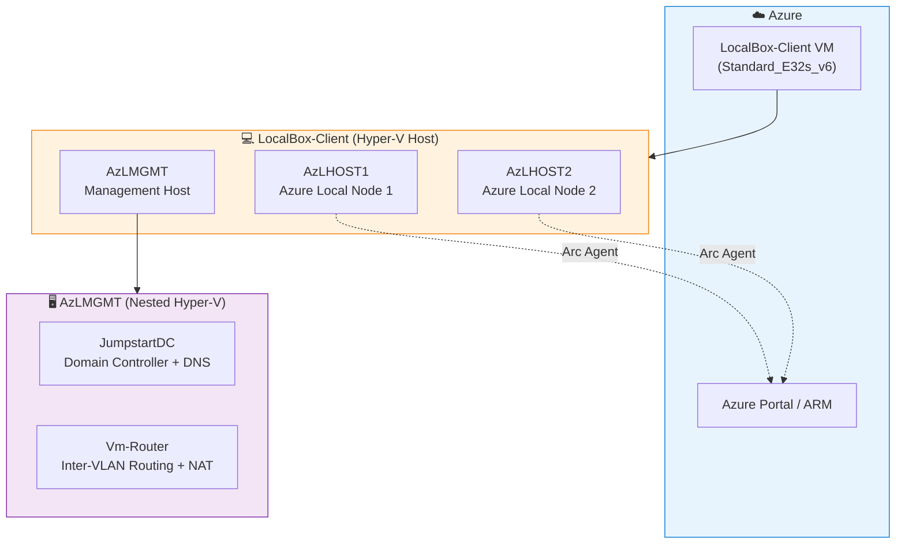
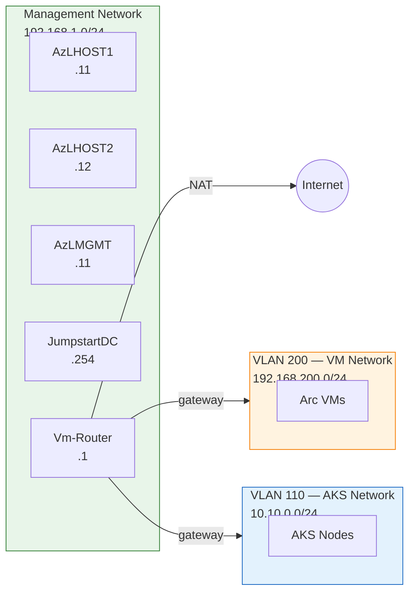

# Exercise 0: Explore the Architecture

## Learning Objectives

By the end of this exercise, you will understand:

- How Azure Local uses nested virtualization to run an on-premises-like environment in Azure
- The role of each virtual machine in the LocalBox stack
- How Azure Arc connects on-premises resources to the Azure control plane
- The networking topology that connects the nested VMs

## Context

Azure Local (formerly Azure Stack HCI) is Microsoft's hybrid cloud operating system. It runs on physical hardware in your datacenter but is managed from Azure. **LocalBox** simulates this entire setup inside a single Azure VM using nested Hyper-V virtualization — no physical servers needed.

Think of it as a miniature datacenter running inside Azure, connected back to Azure through Arc.

### Architecture Overview



### Network Topology



## The Challenge

You've just deployed LocalBox. Before touching any portal features, **map the complete architecture** by exploring the nested virtualization stack. Your goal is to answer:

1. How many layers of virtualization exist?
2. What does each VM do, and why is it needed?
3. How do the nested VMs communicate with each other and with Azure?
4. Where does Azure Arc fit in this picture?

## Getting Started

1. **Connect to LocalBox-Client** — Use RDP to connect to the Azure VM (see the deployment output for the IP address)
2. **Open Hyper-V Manager** — This is the starting point for understanding the nested stack

> ⚠️ **If an Azure Firewall was deployed**: All traffic to the LocalBox-Client VM is routed through the firewall. For RDP to work, you need a static route in the route table (`LocalBox-RT`) that sends your client's public IP directly to the Internet (bypassing the firewall). Run `scripts/update-client-route.sh` to automatically detect your public IP and add the route, or add it manually in the Azure Portal under Route Tables → `LocalBox-RT` → Routes.

## Exploration Tasks

### Task 1: Map the VM Hierarchy

Open Hyper-V Manager on LocalBox-Client. You should see several nested VMs.

**Questions to answer:**
- Which VMs are running directly on LocalBox-Client?
- Which VMs are running inside another VM? (Hint: one of the VMs is itself a Hyper-V host)
- Why would the architecture need a VM-inside-a-VM design?

<details>
<summary>🔍 Hint</summary>

Look at the VMs `AzLHOST1`, `AzLHOST2`, and `AzLMGMT`. Then RDP into `AzLMGMT` (from LocalBox-Client: `mstsc /v:192.168.1.11`) and check if it also runs Hyper-V with its own guests.

</details>

<details>
<summary>⚠️ Spoiler: Full Answer</summary>

**Layer 1 — Azure:** LocalBox-Client (Standard_E32s_v6) runs in Azure with Hyper-V enabled.

**Layer 2 — LocalBox-Client hosts:**
- `AzLHOST1` — Azure Local node 1 (the "physical server" in a real deployment)
- `AzLHOST2` — Azure Local node 2
- `AzLMGMT` — Management hypervisor (itself a Hyper-V host)

**Layer 3 — AzLMGMT hosts:**
- `JumpstartDC` — Active Directory Domain Controller (jumpstart.local domain)
- `Vm-Router` — RRAS-based router for network connectivity between subnets

The two-level nesting simulates what would be separate physical infrastructure in a real deployment: the Azure Local nodes are the compute cluster, while the management VMs (DC, router) represent datacenter infrastructure services.

</details>

### Task 2: Understand the Network Topology

From LocalBox-Client, examine the virtual switches and network configuration.

**Questions to answer:**
- How many virtual switches exist?
- What IP subnets are in use and what is each one for?
- How does traffic from the nested Azure Local VMs reach Azure?

<details>
<summary>🔍 Hint</summary>

Run these on LocalBox-Client:
```powershell
Get-VMSwitch
Get-NetIPAddress | Where-Object { $_.AddressFamily -eq 'IPv4' }
```

Also check the routing on Vm-Router — it acts as the gateway between subnets.

Key subnets to look for:
- Management network (192.168.1.0/24)
- Azure Local VM network (192.168.200.0/24, VLAN 200)
- AKS network (10.10.0.0/24, VLAN 110)

</details>

<details>
<summary>⚠️ Spoiler: Full Answer</summary>

The networking stack has multiple layers:

1. **Azure VNet** — The LocalBox-Client VM has a NIC on an Azure VNet with a public IP and NSG
2. **Internal Virtual Switch** — Connects LocalBox-Client to AzLHOST1, AzLHOST2, and AzLMGMT
3. **Management subnet (192.168.1.0/24)** — Used for communication between the host VMs and management
4. **VM subnet (192.168.200.0/24, VLAN 200)** — Dedicated to Arc-managed VMs running on the Azure Local cluster
5. **AKS subnet (10.10.0.0/24, VLAN 110)** — Dedicated to AKS workload clusters

`Vm-Router` acts as the gateway, routing traffic between these subnets and providing NAT for internet access. `JumpstartDC` provides DNS (192.168.1.254) and Active Directory authentication.

Traffic from nested VMs → Vm-Router → LocalBox-Client → Azure VNet → Internet/Azure services.

</details>

### Task 3: Find the Azure Arc Connection

Go to the Azure Portal and look at your resource group.

**Questions to answer:**
- Which resources in the resource group represent the Azure Local nodes?
- What type are they? (Hint: they're not regular Azure VMs)
- What does "Arc-enabled" mean in practical terms?

<details>
<summary>🔍 Hint</summary>

Filter the resource group by type. Look for resources of type `Microsoft.HybridCompute/machines` — these are Arc-enabled servers. They represent machines running *outside* Azure that are connected *to* Azure for management.

</details>

<details>
<summary>⚠️ Spoiler: Full Answer</summary>

In the Azure Portal, you'll find:
- **AzLHOST1** and **AzLHOST2** as `Machine - Azure Arc` resources (type: `Microsoft.HybridCompute/machines`)
- A **LocalBox Cluster** resource (type: `Microsoft.AzureStackHCI/clusters`)
- A **Custom Location** named `jumpstart` that enables deploying Azure services (VMs, AKS) onto the cluster

"Arc-enabled" means these machines run the Azure Connected Machine Agent, which:
- Registers them with Azure Resource Manager
- Enables Azure management features (policies, monitoring, extensions)
- Does NOT require these machines to be Azure VMs — they could be on-prem physical servers

This is the fundamental concept of Azure Arc: **extending the Azure management plane to any infrastructure**.

</details>

### Task 4: Verify the Azure Local Cluster

In the Azure Portal, find the cluster resource.

**Questions to answer:**
- What is the cluster health status?
- How many nodes does it have?
- What Azure Local version is running?
- What custom location was created, and why?

<details>
<summary>⚠️ Spoiler: Full Answer</summary>

Navigate to the `localboxcluster` resource in your resource group:
- **Overview** shows the cluster health, node count (2), and software version (24H2)
- **Settings → Deployments** shows the cluster provisioning history
- The **Custom Location** (`jumpstart`) is an abstraction that maps the physical cluster to a location where Azure resource types (VMs, AKS clusters) can be deployed — it's the bridge between "this cluster" and "deploy things here via Azure"

</details>

## Reflection Questions

Take a moment to think about these — there's no single right answer:

1. **Why does Azure Local need nested virtualization for an emulated environment?** Could this be done with containers instead?

2. **What would be different in a real (physical) Azure Local deployment?** Which VMs would be real servers? What wouldn't exist at all?

3. **If you had to explain Azure Arc to a colleague in one sentence, what would you say?** Think about what you observed — Arc-enabled servers being "regular" machines connected to Azure.

4. **What happens to the Azure Local cluster if Azure goes offline?** Workloads keep running? Management breaks? Both?

## Next Exercise

➡️ [Exercise 1: Azure Portal Exploration](./01-azure-portal-exploration.md)
