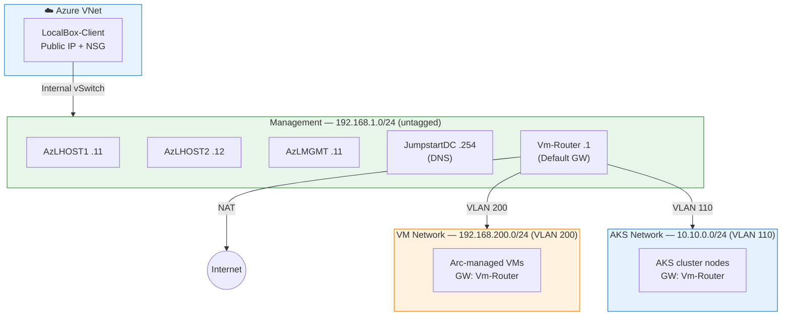

# Exercise 2: Networking & VM Management

## Learning Objectives

By the end of this exercise, you will understand:

- How logical networks work on Azure Local and why they're needed
- How to create VM images from Azure Marketplace for on-prem deployment
- The end-to-end workflow for deploying a VM on Azure Local through Azure Portal
- IP addressing, VLAN segmentation, and DNS in a hybrid environment

## Prerequisites

- Completed Exercises 0 and 1
- LocalBox cluster fully deployed and operational
- RDP access to LocalBox-Client VM

## Context

In a traditional Azure deployment, you create a VNet, add a subnet, and deploy a VM — Azure handles all the networking plumbing. On Azure Local, you're responsible for the physical (or emulated) network. You need to create **logical networks** that map to your actual network infrastructure before you can deploy VMs. This is closer to how a real datacenter operates.

## Understanding the Network Before You Start

LocalBox comes with preconfigured network segments at the infrastructure level (Hyper-V virtual switches and VLAN routing on the VM-Router). These exist in the underlying network fabric but are **not** automatically visible as Azure "Logical Network" resources — you need to create those yourself in Challenge 1.

To see the raw network topology, you'd check the VM-Router (`ip addr`, `ip route`) or the Hyper-V switch config on the nodes. Here's what the infrastructure provides:



| Network | Subnet | VLAN | Purpose |
|---------|--------|------|---------|
| Management | 192.168.1.0/24 | - | Cluster nodes, DC, router |
| VM Network | 192.168.200.0/24 | 200 | Arc-managed VMs |
| AKS Network | 10.10.0.0/24 | 110 | AKS workload clusters |

> **Key concept:** Unlike Azure VNets (which are software-defined and abstract), logical networks on Azure Local map directly to physical switch ports, VLANs, and IP ranges. Creating a logical network in Azure doesn't create the underlying network — it merely *declares* an existing network segment so Azure can assign IPs and attach VM NICs to it. If you get the VLAN or subnet wrong, your VMs won't have connectivity.

---

## Challenge 1: Create a Logical Network

**Goal:** Create a logical network resource that maps to the preconfigured VM subnet (192.168.200.0/24, VLAN 200) so you can deploy VMs.

**What you need to figure out:**
- Where in the Azure portal do you create a logical network for Azure Local?
- What parameters does it need (subnet, gateway, DNS, VLAN)?
- How do you verify the logical network was created correctly?

<details>
<summary>🔍 Hint 1 — Where to start</summary>

In the Azure Portal, navigate to your resource group and look at the Azure Local cluster resource (`localboxcluster`). Under **Settings** or **Resources**, look for networking-related options. Alternatively, search for "Logical Networks" in the portal search bar.

</details>

<details>
<summary>🔍 Hint 2 — Parameters</summary>

The logical network needs these settings:
- **Name:** something descriptive (e.g., `vm-network-200`)
- **VM switch name:** `ConvergedSwitch(compute_management)` — you can discover this by running `Get-VMSwitch` on a cluster node
- **Subnet:** 192.168.200.0/24
- **Gateway:** 192.168.200.1
- **IP allocation method:** Static
- **IP pool:** 192.168.200.100 – 192.168.200.199
- **VLAN ID:** 200
- **DNS Server:** 192.168.1.254 (the domain controller)

> ⚠️ **Important:** Double-check all values before creating the logical network. Some settings (such as DNS servers) **cannot be changed after creation** — you would need to delete and recreate the logical network, which also means recreating any VMs attached to it.

Using static IP allocation (with a defined pool) ensures VMs get predictable addresses and that DNS is properly configured on each VM.

</details>

<details>
<summary>⚠️ Spoiler: Full Solution</summary>

1. Azure Portal → your resource group → click on the `localboxcluster` resource
2. In the left menu, go to **Resources** → **Logical networks**
3. Click **+ Create**
4. Fill in:
   - **Name:** `vm-network-200`
   - **VM switch name:** `ConvergedSwitch(compute_management)`
   - **IP address allocation method:** Static
   - Add a subnet with:
     - Address prefix: `192.168.200.0/24`
     - Gateway: `192.168.200.1`
     - VLAN: `200`
     - DNS servers: `192.168.1.254`
     - IP pool start: `192.168.200.100`
     - IP pool end: `192.168.200.199`
5. Click **Review + Create** → **Create**
6. Verify: the logical network should appear in your resource group within a minute

> ⚠️ **Double-check before creating!** Some logical network settings (DNS servers, subnet prefix, gateway) cannot be modified after creation. If you make a mistake, you'll need to delete the logical network and recreate it (along with any VMs using it).

> **Note:** There is also a script `C:\LocalBox\Configure-VMLogicalNetwork.ps1` on LocalBox-Client that does the same thing via CLI, if you prefer to review the programmatic approach after completing the portal walkthrough.

</details>

---

## Challenge 2: Create a VM Image from a Local VHD

**Goal:** Before creating a VM, you need an OS image registered in Azure Local. In this emulated environment, the Azure Marketplace download feature doesn't work reliably (the Edge Marketplace service isn't reachable). Instead, you'll register an image from a VHD that already exists on cluster storage.

**What you need to figure out:**
- What VHD files already exist on the cluster's shared storage?
- How do you register a local VHD as a VM image in Azure Local?
- What's the difference between a marketplace image and a local path image?

> 💡 **Think about it:** Why can't Azure Local VMs just use Azure Marketplace images directly like regular Azure VMs? What's different about the compute infrastructure?

> 💡 **Background:** The LocalBox deployment pre-provisions a CBL-Mariner Linux VHD on cluster storage for AKS node images. You can reuse this VHD to create a general-purpose Linux VM image — or you can bring your own VHD (see Challenge 2b for a custom Linux image approach).

<details>
<summary>🔍 Hint 1 — Finding existing VHDs</summary>

The cluster stores VHDs on Cluster Shared Volumes (CSVs). You can discover them by running commands on the HCI nodes. From LocalBox-Client (RDP), open PowerShell and connect to a cluster node:

```powershell
# List CSVs
Invoke-Command -VMName AzLHOST1 -Credential (Get-Credential jumpstart\Administrator) -ScriptBlock {
    Get-ChildItem 'C:\ClusterStorage' -Recurse -Include *.vhdx | Select-Object FullName, @{N='SizeGB';E={[math]::Round($_.Length/1GB,1)}}
}
```

Look for a CBL-Mariner VHDX in `UserStorage_1` — this is the AKS base image that LocalBox pre-downloads during deployment.

</details>

<details>
<summary>🔍 Hint 2 — Registering the image</summary>

You can register a VHD from a local path using either:
- **Azure Portal:** Cluster resource → VM Images → Add VM image → From local share → provide the CSV path
- **Azure CLI:** `az stack-hci-vm image create --image-path <path-on-cluster> --os-type Linux ...`

The key is using the **local CSV path** (e.g., `C:\ClusterStorage\UserStorage_1\...`), NOT a UNC path. The CSV is mounted identically on all cluster nodes.

</details>

<details>
<summary>⚠️ Spoiler: Full Solution</summary>

**Option A — Azure Portal:**

1. Azure Portal → cluster resource → **VM Images** → **Add VM image** → **From local share**
2. Provide the local CSV path: `C:\ClusterStorage\UserStorage_1\<subfolder>\linux-cblmariner-0.10.9.10205.vhdx`
   (The subfolder name is auto-generated — check via the hint above)
3. Set OS type = **Linux**, name it (e.g., `linux-mariner`)
4. Select the `jumpstart` custom location
5. Click **Review + Create** → **Create**

**Option B — Azure CLI (from LocalBox-Client):**

```powershell
# Get context info
$rg = "azlocal"
$customLocation = (az customlocation list -g $rg --query "[0].id" -o tsv)
$location = (az stack-hci cluster list -g $rg --query "[0].location" -o tsv)
$storagePath = (az stack-hci-vm storagepath list -g $rg --query "[0].id" -o tsv)

# Find the VHD path (run on cluster node to get the exact subfolder name)
# Example: C:\ClusterStorage\UserStorage_1\e17597df2d246ec\linux-cblmariner-0.10.9.10205.vhdx

# Register the image
az stack-hci-vm image create `
    --resource-group $rg `
    --name linux-mariner `
    --location $location `
    --custom-location $customLocation `
    --os-type Linux `
    --image-path "C:\ClusterStorage\UserStorage_1\<subfolder>\linux-cblmariner-0.10.9.10205.vhdx" `
    --storage-path-id $storagePath
```

> 💡 **Why does this work?** The `--image-path` parameter tells the MOC operator (running on the cluster nodes) to register an existing VHD from local storage. No download is needed — the file is already on the CSV. This is much faster than a marketplace download and works reliably in the emulated environment.

> **Why can't Azure Local use marketplace images directly?** Because the cluster isn't in an Azure datacenter. In production, the Edge Marketplace service downloads images to local storage. In LocalBox's emulated environment, this service isn't fully functional, so we use the local path approach instead.

</details>

---

## Challenge 2b (Optional): Create a Custom Linux Image

**Goal:** The Azure Local marketplace only offers Windows images. If you want to run Linux VMs, you need to bring your own image. Download a Linux cloud image and register it as a custom VM image.

**What you need to figure out:**
- Where can you get a Linux cloud image (VHDX or VHD format)?
- How do you upload and register a custom image in Azure Local?

<details>
<summary>🔍 Hint 1 — Getting the image</summary>

Most Linux distributions publish cloud-ready images in VHD format. However, you must ensure the image supports **Gen2 (UEFI)** boot — Azure Local creates Gen2 VMs by default and Gen1 (MBR/BIOS) images will fail with "corrupted and unreadable" errors.

**Recommended: Rocky Linux 9** (proven to work as Gen2 on Azure Local):
- URL: `https://dl.rockylinux.org/pub/rocky/9/images/x86_64/Rocky-9-Azure-Base.latest.x86_64.vhdfixed.xz`
- ~493 MB compressed (xz format), needs decompression with 7-Zip
- Azure-specific build = Gen2/UEFI, fixed-size VHD (exactly what Azure Local expects)

**Avoid:** Ubuntu "azure" images (`noble-server-cloudimg-amd64-azure.vhd.tar.gz`) — these are Gen1 (MBR/BIOS) only and no EFI variant is available.

Download the image to LocalBox-Client first, then decompress:
```powershell
# Download Rocky Linux 9 Azure VHD
Invoke-WebRequest -Uri "https://dl.rockylinux.org/pub/rocky/9/images/x86_64/Rocky-9-Azure-Base.latest.x86_64.vhdfixed.xz" -OutFile "C:\Temp\rocky9.vhd.xz"

# Decompress with 7-Zip
& "C:\Program Files\7-Zip\7z.exe" x "C:\Temp\rocky9.vhd.xz" -o"C:\Temp\"
```

</details>

<details>
<summary>🔍 Hint 2 — Copying to cluster storage</summary>

You need to copy the VHD to a Cluster Shared Volume (CSV) so the cluster can access it. Since LocalBox-Client isn't domain-joined, you need explicit credentials:

```powershell
net use Z: \\AzLHOST1\C$\ClusterStorage\UserStorage_1 /user:jumpstart\Administrator <your-deployment-password>
Copy-Item "C:\path\to\image.vhd" "Z:\"
```

> ⚠️ **Important:** The UNC path (`\\AzLHOST1\C$\...`) is only for **copying** from LocalBox-Client. When **registering** the image in the portal, use the **local CSV path** instead: `C:\ClusterStorage\UserStorage_1\image.vhd`. The CSV is mounted identically on all cluster nodes — if you use the UNC admin share path, the MOC operator on other nodes won't have access and the import will fail.

</details>

<details>
<summary>⚠️ Spoiler: Full Solution</summary>

**Step 1 — Download and extract the image on LocalBox-Client:**

```powershell
# Create a temp directory
New-Item -ItemType Directory -Path "C:\Temp" -Force

# Download Rocky Linux 9 Azure VHD (~493 MB)
Invoke-WebRequest -Uri "https://dl.rockylinux.org/pub/rocky/9/images/x86_64/Rocky-9-Azure-Base.latest.x86_64.vhdfixed.xz" -OutFile "C:\Temp\rocky9.vhd.xz"

# Decompress with 7-Zip (produces Rocky-9-Azure-Base.latest.x86_64.vhdfixed)
& "C:\Program Files\7-Zip\7z.exe" x "C:\Temp\rocky9.vhd.xz" -o"C:\Temp\"
```

**Step 2 — Copy the VHD to Cluster Shared Volume:**

LocalBox-Client is not domain-joined, so you need explicit credentials to access the cluster storage:

```powershell
# Map a drive to the cluster shared volume (UNC admin share — for copying only)
net use Z: \\AzLHOST1\C$\ClusterStorage\UserStorage_1 /user:jumpstart\Administrator <your-deployment-password>

# Create an images directory and copy the VHD
New-Item -ItemType Directory -Path "Z:\images" -Force
Copy-Item "C:\Temp\Rocky-9-Azure-Base.latest.x86_64.vhdfixed" "Z:\images\rocky9.vhd"
```

**Step 3 — Register the image in the Azure Portal:**

1. Azure Portal → cluster resource → **VM Images** → **Add VM image** → **From local share**
2. Provide the **local CSV path** (not the UNC path!): `C:\ClusterStorage\UserStorage_1\images\rocky9.vhd`
3. Set OS type = **Linux**, give it a name (e.g., `rockylinux-9`)
4. Select the `jumpstart-cl` custom location
5. Click **Review + Create** → **Create**

> 💡 **Tip:** Custom images from local storage import much faster than marketplace images. A marketplace Windows Server image can take over an hour to download, while a local VHD that's already on the CSV registers in just a few minutes.

</details>

---

## Challenge 3: Deploy a Virtual Machine

**Goal:** Deploy a virtual machine on your Azure Local cluster through the Azure Portal, connected to the logical network you created.

**Requirements:**
- Use the VM image you downloaded
- Connect it to the logical network from Challenge 1
- Configure it with 2 vCPUs and 4-8 GB RAM (the cluster has limited resources)
- Successfully connect to the VM

**What you need to figure out:**
- How to create the VM from the Azure Portal
- How to add a network interface and associate it with your logical network
- How to connect to the VM (remember: it's on a nested network, not directly accessible from the internet)

<details>
<summary>🔍 Hint 1 — Creating the VM</summary>

Cluster resource → **Virtual machines** blade → **Create virtual machine**.

Keep resources small! The LocalBox cluster has limited RAM. Use:
- 2 vCPUs
- 4096 MB memory (or 8192 if available)
- Standard security type

</details>

<details>
<summary>🔍 Hint 2 — Networking</summary>

On the Networking tab, click "Add network interface" and select the logical network you created in Challenge 1. Set allocation method to Automatic.

</details>

<details>
<summary>🔍 Hint 3 — Connecting to the VM</summary>

The VM is on the 192.168.200.0/24 subnet, which is NOT directly routable from your machine or even from LocalBox-Client. You need to "hop" through the management VM (AzLMGMT at 192.168.1.11):

**For Windows VMs:**
1. From LocalBox-Client: `mstsc /v:192.168.1.11` (connect to AzLMGMT)
2. From AzLMGMT: `mstsc /v:192.168.200.x` (connect to your new VM, replace x with its IP)

**For Linux VMs:**
1. From LocalBox-Client: `mstsc /v:192.168.1.11` (connect to AzLMGMT)
2. From AzLMGMT, open PowerShell or Command Prompt:
   ```
   ssh <username>@192.168.200.x
   ```
   Use the credentials you specified when creating the VM. If the VM uses a cloud image (e.g., Rocky Linux), the default user may vary — check what you configured during VM creation.

</details>

<details>
<summary>⚠️ Spoiler: Full Solution</summary>

**Create the VM:**
1. Azure Portal → Cluster resource → Virtual machines → Create virtual machine
2. Fill in:
   - Resource group: your LocalBox RG
   - Name: e.g., `test-vm-01`
   - Security type: Standard
   - Image: select the image you downloaded
   - vCPUs: 2
   - Memory: 4096 or 8192 MB
3. Click Next → Next to reach Networking
4. Click "Add network interface"
   - Name: `test-vm-01-nic`
   - Network: select your logical network
   - Allocation: Automatic
5. Review + Create → Create

**Connect to it:**
1. Wait for the VM to show as "Running" in the portal
2. Check its IP address in the VM resource's properties (will be in 192.168.200.x range)
3. From LocalBox-Client: `mstsc /v:192.168.1.11` (connect to AzLMGMT)
4. From AzLMGMT:
   - **Windows VM:** `mstsc /v:192.168.200.x`
   - **Linux VM:** open PowerShell and run `ssh <username>@192.168.200.x`

**Note:** The VM appears as an Azure resource managed through Arc, just like it would on real Azure Local hardware. You can see it in the portal, apply policies to it, and monitor it — even though it's running on your "on-prem" cluster.

</details>

---

## Deep Dive: IP Planning Matters

Before moving on, consider this real-world scenario:

> You have a 192.168.200.0/24 subnet with 254 usable IPs. You want to deploy:
> - 20 production VMs
> - An AKS cluster that needs 30 IPs (nodes + pods + services)
> - Room for future growth
>
> **Is this subnet big enough?** What if you also need static IPs for some services?

<details>
<summary>🔍 Think About It</summary>

In real Azure Local deployments, IP exhaustion is a common problem because:
1. AKS clusters need IPs for nodes, load balancers, and services
2. VMs each need at least one IP
3. Some IPs are reserved (gateway, broadcast)
4. You often need separate subnets/VLANs for different workloads

In LocalBox, the subnets are pre-sized for lab use. In production, careful IP planning is essential before deployment.

</details>

## Reflection Questions

1. **How does VM deployment on Azure Local compare to deploying an Azure VM?** What steps are similar? What's completely different?

2. **Why does Azure Local need VLAN-based network segmentation?** Could you use Azure-style VNets instead?

3. **If the Azure connection went offline, could you still manage VMs on the cluster?** What tools would you use?

## Next Exercise

➡️ [Exercise 3: AKS on Azure Local](./03-aks-on-azure-local.md)
