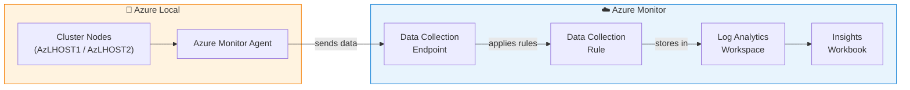

# Exercise 4: Monitoring & Observability

## Learning Objectives

By the end of this exercise, you will understand:

- How Azure Monitor extends to hybrid infrastructure through Azure Arc
- The difference between platform metrics and custom monitoring via Insights
- How Data Collection Rules (DCRs) and Data Collection Endpoints (DCEs) work
- How to query logs from on-premises infrastructure using KQL in Log Analytics

## Prerequisites

- Completed Exercises 0-1 (architecture and portal understanding)
- LocalBox cluster operational
- Access to Azure Portal

## Context

In traditional on-premises environments, monitoring is typically a separate island — you use tools like SCOM, Nagios, or Zabbix that have no connection to your cloud monitoring. Azure Local changes this by integrating directly with **Azure Monitor**, giving you a unified monitoring experience across cloud and on-prem.

This means the same alerts, dashboards, and log queries you use for Azure VMs can work for your Azure Local cluster.



---

## Challenge 1: Discover What's Already Monitored

**Goal:** Before configuring anything new, discover what monitoring data is already being collected from your Azure Local cluster out of the box.

**Questions to answer:**
- Is there platform monitoring data visible on the cluster Overview page?
- What metrics are available without any additional configuration?
- Can you see cluster health, node health, and storage health?

<details>
<summary>🔍 Hint</summary>

Navigate to the `localboxcluster` resource → **Overview**. Platform monitoring (basic health and status metrics) is available by default — no additional configuration needed.

Also check the **Monitoring** section in the left menu for any pre-configured Metrics or Alerts.

</details>

---

## Challenge 2: Enable Insights Monitoring

**Goal:** Configure Azure Monitor Insights for your Azure Local cluster to get detailed performance and health monitoring.

This requires creating:
1. A **Data Collection Rule (DCR)** — defines what data to collect and where to send it
2. A **Data Collection Endpoint (DCE)** — the ingestion endpoint for the data

**What you need to figure out:**
- Where to start the Insights configuration wizard
- What Log Analytics workspace to use
- How to verify data is flowing

<details>
<summary>🔍 Hint 1</summary>

Go to the cluster resource → **Capabilities** tab → **Insights** → **Getting Started**. This will launch a wizard that walks you through creating the DCR and DCE.

Use the existing `LocalBox-Workspace` Log Analytics workspace.

</details>

<details>
<summary>⚠️ Spoiler: Full Solution</summary>

1. Azure Portal → `localboxcluster` → **Capabilities** tab
2. Click **Insights** → **Getting Started**
3. Follow the wizard:
   - Rule name: something descriptive (e.g., `dcr00` — note: `AzureStackHCI` is automatically prepended)
   - Data Collection Endpoint: create a new one (e.g., `azlocal-dce`)
   - Destination: select the `LocalBox-Workspace` Log Analytics workspace
4. Click **Review + Create** and wait for deployment
5. **Wait 15-30 minutes** for initial data to flow
6. Return to cluster → **Insights** blade to view the monitoring workbook

**Understanding what you just configured:**
- The DCR tells Azure Monitor *what* to collect (performance counters, event logs, etc.)
- The DCE is the *endpoint* where agents on the cluster nodes send data
- The destination is a **Log Analytics workspace** (queried with KQL) — not to be confused with an Azure Monitor workspace (which is for Prometheus/PromQL)

</details>

---

## Challenge 3: Query Logs with KQL

**Goal:** Write KQL (Kusto Query Language) queries against the Log Analytics workspace to answer operational questions about your cluster.

Once data is flowing (wait at least 15-30 minutes after enabling Insights), navigate to the Log Analytics workspace and try to answer:

1. **What events have been logged in the last hour?**
2. **What is the CPU utilization trend for the cluster nodes?**
3. **Are there any warning or error events?**

<details>
<summary>🔍 Hint — Getting Started with KQL</summary>

Go to `LocalBox-Workspace` → **Logs**. This opens the KQL query editor. Try these queries:

```kql
// See what tables have data
search * | summarize count() by $table | sort by count_ desc

// Recent events
Event
| where TimeGenerated > ago(1h)
| project TimeGenerated, Computer, EventLevelName, RenderedDescription
| sort by TimeGenerated desc
| take 50
```

</details>

<details>
<summary>⚠️ Spoiler: Sample Queries</summary>

```kql
// 1. All events in the last hour
Event
| where TimeGenerated > ago(1h)
| summarize count() by Computer, EventLevelName
| sort by count_ desc

// 2. Performance data — CPU utilization
Perf
| where ObjectName == "Processor" and CounterName == "% Processor Time"
| where InstanceName == "_Total"
| where TimeGenerated > ago(1h)
| summarize AvgCPU = avg(CounterValue) by bin(TimeGenerated, 5m), Computer
| render timechart

// 3. Warning and error events
Event
| where EventLevelName in ("Warning", "Error")
| where TimeGenerated > ago(24h)
| project TimeGenerated, Computer, EventLevelName, Source, RenderedDescription
| sort by TimeGenerated desc
| take 100

// 4. Memory utilization
Perf
| where ObjectName == "Memory" and CounterName == "% Committed Bytes In Use"
| where TimeGenerated > ago(1h)
| summarize AvgMemory = avg(CounterValue) by bin(TimeGenerated, 5m), Computer
| render timechart
```

</details>

---

## Challenge 4: Enable Recommended Alerts

**Goal:** Enable the predefined alert rules that Azure offers for your Azure Local cluster, and then inspect the underlying KQL queries to understand how they work.

The Azure portal offers a set of **recommended alerts** for Azure Local clusters — predefined rules for common conditions like high CPU, memory pressure, and storage utilization. These don't require writing any KQL yourself.

> 💡 **Think about it first:** In a real production environment, what alerts would be critical for an Azure Local cluster? CPU? Memory? Storage? Network? Cluster health?

**What you need to figure out:**
- Where to find the recommended/predefined alerts for your cluster
- How to enable them (and optionally configure an action group for notifications)
- Once created, where to inspect the KQL query behind each alert rule

<details>
<summary>🔍 Hint</summary>

Navigate to the cluster resource → **Monitoring** → **Alerts** → look for a **Recommended alerts** or **Alert rules** option. The portal will offer preconfigured rules such as:
- Average CPU utilization > 80%
- Available memory below threshold
- Storage pool utilization

Enable the ones that seem relevant. You can configure an action group (email, webhook) or skip that for now.

</details>

<details>
<summary>⚠️ Spoiler: Full Solution</summary>

1. Azure Portal → `localboxcluster` → **Monitoring** → **Alerts**
2. Look for **Recommended alert rules** (or click **Alert rules** → **+ Enable recommended alerts**)
3. Enable the predefined rules — at minimum:
   - CPU utilization > 80%
   - Available memory percentage
   - Storage utilization
4. Optionally create an **Action group** (email/SMS) to receive notifications
5. Click **Enable** / **Save**

**Learning exercise — Inspect the KQL behind the alerts:**

Once the rules are created, go to **Alert rules** (in the Alerts blade), click on one of the rules you just enabled, and look at the **Condition** section. You'll see the KQL query that powers the alert. For example, the CPU alert likely uses something like:

```kql
Perf
| where ObjectName == "Processor" and CounterName == "% Processor Time"
| where InstanceName == "_Total"
| summarize AggregatedValue = avg(CounterValue) by bin(TimeGenerated, 5m), Computer
| where AggregatedValue > 80
```

Understanding these queries helps you:
- Customize thresholds for your environment
- Create new alerts for conditions not covered by the defaults
- Troubleshoot why an alert did or didn't fire

In production, you'd also want alerts for:
- Cluster node going offline
- Azure Arc agent disconnections
- Replication health degradation

</details>

---

## Deep Dive: Understanding the Monitoring Data Pipeline

Take a moment to understand how monitoring data flows in this architecture:

```
Azure Local Node (AzLHOST1/2)
  └─ Azure Monitor Agent (extension installed via Arc)
      └─ Collects: Performance counters, Event logs, Custom logs
          └─ Sends to: Data Collection Endpoint (DCE)
              └─ Routed by: Data Collection Rule (DCR)
                  └─ Stored in: Log Analytics Workspace
                      └─ Visualized in: Insights workbooks, dashboards
                      └─ Queried via: KQL
                      └─ Alerts: Alert rules evaluate query results
```

**Key insight:** This is the *exact same pipeline* used for Azure VMs. The Azure Monitor Agent doesn't care if it's running on a cloud VM or an Arc-enabled on-prem server — the data flows through the same infrastructure.

> **Log Analytics workspace vs. Azure Monitor workspace — don't confuse them!**
> - A **Log Analytics workspace** stores logs and performance counters. You query it with **KQL** (Kusto Query Language). This is what DCRs/DCEs feed into for Azure Local Insights.
> - An **Azure Monitor workspace** stores Prometheus metrics. You query it with **PromQL**. This is typically used for AKS container monitoring (e.g., Container Insights with Managed Prometheus).
>
> For Azure Local host monitoring (this exercise), you use **Log Analytics + KQL**. If you later enable Managed Prometheus for your AKS cluster (Exercise 3), that data goes to an **Azure Monitor workspace + PromQL**.

## Reflection Questions

1. **What's the advantage of using Azure Monitor for on-prem infrastructure instead of a dedicated tool like Zabbix or Prometheus?** What are the trade-offs?

2. **The monitoring data is sent to Azure (Log Analytics workspace). What are the compliance implications?** What if you can't send telemetry to the cloud?

3. **How would you build a single dashboard that shows health for both your Azure VMs and Azure Local cluster?** What tool would you use?

## Next Exercise

➡️ [Exercise 5: Security & Governance](./05-security-and-governance.md)
