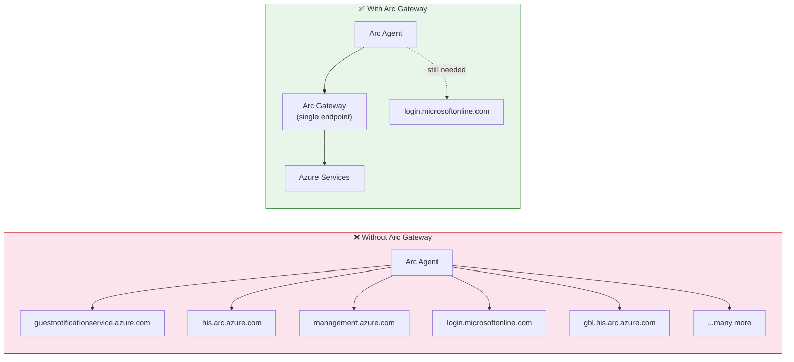

# Exercise 8 — Arc Gateway and Network Security

## Learning Objectives

By the end of this exercise, you will understand:

- What endpoints Arc-connected machines communicate with during normal operation
- How Azure Arc Gateway reduces the network footprint for Arc-enabled servers
- How to compare Azure Firewall logs before and after Arc Gateway to measure the difference

## Prerequisites

- Completed Exercises 1, 4, and 5
- A working LocalBox deployment with `AzLHOST1` and `AzLHOST2` connected to Azure Arc
- Azure Firewall deployed and sending logs to a Log Analytics workspace
- Azure CLI access with permission to create Arc Gateway resources

## Context

Azure Arc-enabled servers are powerful because they make on-premises machines look and behave like Azure resources. The tradeoff is that the Arc agents need to talk to several Azure endpoints for control-plane operations, authentication, metadata, and extension workflows.

That is manageable in a lab, but in a locked-down enterprise network it creates two common questions:

1. **How many outbound destinations do I need to allow?**
2. **Can I simplify the firewall policy without breaking Arc?**

Azure Arc Gateway is designed for exactly that problem. Instead of every Arc-enabled machine calling many Azure endpoints directly, the agents can proxy through a single Arc Gateway endpoint. In practice, this makes firewall policy easier to understand, easier to audit, and easier to explain to security teams.



Official reference: [Simplify network configuration requirements with Azure Arc gateway](https://learn.microsoft.com/en-us/azure/azure-arc/servers/arc-gateway)

---

## Part 1: Baseline — Observe Direct Connectivity

**Goal:** Understand the starting point before you introduce Arc Gateway.

### Why this matters

If you do not measure the current state first, you cannot prove that Arc Gateway changed anything. This part gives you the baseline: the set of FQDNs the Arc agents contact when they operate in **direct** mode.

### Tasks

1. Deploy Azure Firewall if you have not already done so.
   - Use your `deploy-firewall` helper if you have one in your branch.
   - Otherwise, deploy Azure Firewall by your preferred method and make sure application rule logs are flowing to Log Analytics.
2. Wait **15-30 minutes** so the Arc agents on `AzLHOST1` and `AzLHOST2` generate enough normal traffic.
3. Run your `monitor-firewall-logs` helper script, or the equivalent Log Analytics query, and capture the distinct FQDNs contacted by the Arc agents.
4. Look for well-known Arc and authentication endpoints such as:
   - `guestnotificationservice.azure.com`
   - `his.arc.azure.com`
   - `management.azure.com`
   - `login.microsoftonline.com`
   - `pas.windows.net`
   - and many more, depending on agent version and extension activity

### Verification

- Confirm both nodes are still Arc-connected in the Azure portal.
- Confirm your firewall log query shows **multiple distinct FQDNs**, not just one or two.
- Save a screenshot or exported list. You will compare it later.

<details>
<summary>⚠️ Spoiler alert — what you should expect</summary>

In direct mode, Arc traffic usually looks "chatty" from a firewall perspective. Even though the machines are just two servers, they often reach several Azure destinations for authentication, control-plane requests, heartbeat traffic, and other agent workflows.

That is the key observation for this lab: **Arc works, but the firewall policy is broader and the log output is noisier.**

</details>

---

## Part 2: Deploy Arc Gateway

**Goal:** Create the Arc Gateway resource and point the agents at it.

### Why this matters

This is the architectural change. After this step, the Azure Connected Machine agent keeps doing its normal work, but much of the outward network path is consolidated through the Arc Gateway endpoint.

### Tasks

Run one of these commands:

```powershell
# Create the gateway resource only (then configure manually)
.\scripts\deploy-arc-gateway.ps1 -ResourceGroup <your-resource-group> -NestedAdminPassword <password>

# Create AND configure the agents in one step
.\scripts\deploy-arc-gateway.ps1 -ResourceGroup <your-resource-group> -NestedAdminPassword <password> -Configure
```

> **Note:** The `NestedAdminPassword` is the same password you used when deploying LocalBox (the `windowsAdminPassword` from the ARM template). The script needs it to run commands on the nested Hyper-V hosts via `Invoke-Command`.

> **Agent version note:** Arc Gateway requires azcmagent **v1.47 or later**. Recent LocalBox builds ship with a compatible version. You can verify by running `azcmagent version` on each nested host. If you encounter `unknown configuration property` errors for `connection.gateway-resource-id`, upgrade the agent:
> ```powershell
> # On each nested host (via Invoke-Command or RDP to LocalBox-Client):
> Invoke-WebRequest -Uri "https://aka.ms/AzureConnectedMachineAgent" -OutFile "$env:TEMP\AzureConnectedMachineAgent.msi" -UseBasicParsing
> Start-Process msiexec.exe -ArgumentList "/i", "$env:TEMP\AzureConnectedMachineAgent.msi", "/qn", "/norestart" -Wait
> azcmagent version  # Should show 1.47+
> ```

If you do **not** use `-Configure`, the script prints the manual steps. Those steps do two things:

1. Associate the Arc-enabled server resources with the Arc Gateway resource in Azure (ARM-level)
2. Reconfigure the local agent on `AzLHOST1` and `AzLHOST2`:
   - `azcmagent config set connection.type gateway`
   - `Restart-Service himds`
   
   > 💡 You do **not** need to set `connection.gateway-resource-id` locally — the agent picks up the gateway URL automatically from the ARM association created in step 1.

### Verification

On each nested node, verify:

```powershell
azcmagent show
azcmagent check
```

You are looking for the agent to remain **Connected** and to report gateway-style connectivity rather than broad direct access.

<details>
<summary>⚠️ Spoiler alert — what is happening under the hood</summary>

Arc Gateway does **not** change the fact that the machines are Arc-enabled. It changes the **network path**.

The flow becomes:

```text
Arc agent on AzLHOST1 / AzLHOST2
        ↓
Azure Arc proxy on the server
        ↓
Your outbound network path / Azure Firewall
        ↓
<gateway-name>.gw.arc.azure.com
        ↓
Azure Arc services
```

The important lesson is that Arc Gateway is mainly a **network simplification feature**. It is especially useful when a security team wants a smaller, more explicit outbound allow-list.

</details>

---

## Part 3: Compare — Observe Gateway Connectivity

**Goal:** Prove the change by comparing firewall logs again.

### Tasks

1. Wait another **15-30 minutes** after enabling Arc Gateway.
2. Run the same `monitor-firewall-logs` helper or Log Analytics query you used in Part 1.
3. Compare the list of distinct FQDNs before and after.
4. Identify which traffic patterns disappeared from the direct-connect view and which ones remain necessary.

### What to look for

- **Fewer distinct FQDNs** in the firewall logs
- A stronger concentration of traffic around the Arc Gateway endpoint
- Remaining required control/authentication endpoints that are still part of the Arc design

### Verification

- The Arc agents remain healthy and connected
- The firewall logs show a noticeably smaller set of destinations
- You can explain **why** the reduction happened, not just that it happened

<details>
<summary>⚠️ Spoiler alert — expected result</summary>

You should still see some essential Azure control-plane and identity traffic, but the overall FQDN spread should be much smaller than in direct mode.

That is the value proposition of Arc Gateway:

- easier outbound firewall policy
- clearer audit trail
- fewer destinations to justify to security reviewers

In other words, **the Arc feature set stays the same, but the network exposure becomes easier to manage.**

</details>

---

## Part 4: Challenge

**Challenge:** Create a restrictive firewall policy that allows **only** the Arc Gateway endpoint plus the minimum essential Arc authentication/control endpoints. Then verify that both Arc agents still function correctly.

### Success criteria

- `AzLHOST1` and `AzLHOST2` stay connected to Azure Arc
- `azcmagent check` succeeds
- Your firewall logs show only the minimal approved destinations

### Verification commands

Run these on each nested node:

```powershell
azcmagent show
azcmagent check
```

And in Azure, confirm the gateway resource still exists:

```bash
az arcgateway show --name LocalBox-ArcGateway --resource-group <your-resource-group>
```

<details>
<summary>⚠️ Spoiler alert — one minimal rule set to start with</summary>

A practical **starting point** for Arc Gateway mode is:

- `<your-gateway-prefix>.gw.arc.azure.com`
- `management.azure.com`
- `login.microsoftonline.com`
- `<region>.login.microsoft.com`
- `gbl.his.arc.azure.com`
- `<region>.his.arc.azure.com`

Important nuances:

- If you are **installing or upgrading** agents, you may also need:
  - `download.microsoft.com`
  - `packages.microsoft.com`
- Some Arc extensions or add-on services can require extra endpoints beyond the core Arc path.
- The exact minimal set depends on what features you use, but the list above is the right conceptual starting point for this lab.

If this restrictive policy works, you have demonstrated the main security value of Arc Gateway: **a much smaller outbound allow-list without losing Arc functionality**.

</details>

---

## Part 5: Clean Up

When you are done testing, you can return the lab to direct connectivity.

```powershell
.\scripts\deploy-arc-gateway.ps1 -ResourceGroup <your-resource-group> -NestedAdminPassword <password> -Remove
```

### Optional cleanup

- Keep Azure Firewall if you want to reuse the logging exercise later
- Or delete the firewall if you want to reduce lab cost

### Verification

- `azcmagent show` reports normal direct connectivity again
- The Arc Gateway resource is deleted from the resource group
- Firewall logs return to the broader direct-connect pattern if you re-test later

---

## Troubleshooting

### Script fails immediately with a warning about extensions

**Symptom:** The `deploy-arc-gateway.ps1` script exits with an error referencing a warning like `Unable to load extension 'azure-devops'`.

**Cause:** PowerShell's `$ErrorActionPreference = "Stop"` treats Azure CLI stderr warnings as terminating errors when captured via `2>&1`.

**Fix:** This was fixed by adding `--only-show-errors` to the `Invoke-AzCli` wrapper. If running an older version of the script, pull the latest or add `--only-show-errors` to line 29 manually.

### Gateway creation times out or hangs

Arc Gateway provisioning can take 5-10 minutes. If the script appears stuck at "Waiting for Arc Gateway provisioning to complete", that is normal. The `az resource wait` command polls every 30 seconds with a 30-minute timeout.

You can check status independently:

```bash
az arcgateway show --name LocalBox-ArcGateway --resource-group <rg> --query provisioningState -o tsv
```

### Agents lose connectivity after configuring gateway

If `azcmagent check` fails after switching to gateway mode:

1. Verify the gateway resource is in `Succeeded` state
2. Ensure the firewall allows traffic to `*.gw.arc.azure.com`
3. Verify the gateway resource ID is set correctly: `azcmagent config get connection.gateway-resource-id`
4. If stuck, revert to direct mode:
   ```powershell
   azcmagent config set connection.type direct
   Restart-Service himds
   ```

---

## Reflection Questions

1. Why is Arc Gateway attractive to security teams even when the Arc feature set itself does not change?
2. Which endpoints are still required even after you introduce Arc Gateway, and why?
3. If you had to document outbound requirements for a production hybrid platform, would you rather hand over the direct-connect list or the Arc Gateway list? Why?

## Next Exercise

➡️ [Exercise 9 (Optional): Challenge — Hybrid Operations](./09-challenge-operations.md)

## Next Step

➡️ Re-run your firewall log query one final time and capture a before/after screenshot pair for future demos or design discussions.
